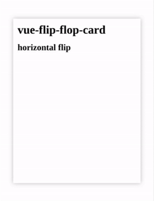
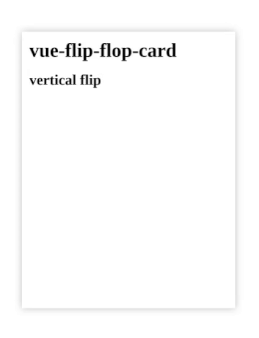
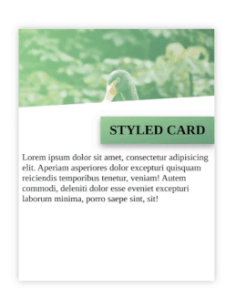

# vue-flip-flop-card

[](https://www.npmjs.com/package/vue-flip-flop-card)
[](https://www.npmjs.com/package/vue-flip-flop-card)
[](https://www.npmjs.com/package/vue-flip-flop-card)


The is a card.. for vue.. that flips!

Why the name flip-flop-card, you ask? Well, hopefully it will be just as easy to
apply in a project, as applying a set of flip flops to your feet. Oh, and the other names were taken, I guess 🤷‍♂️

This is my first attempt making a _reusable_ npm-module, and it's mainly an exercise for me to learn how to package SFCs (Single File Components) for Vue via ***rollupjs***, as well as getting into the habit of maintaining and documenting open-source on npm and git. Not expecting it to work perfectly for all purposes, but will try to maintain from time to time.

Feel free to report issues, fork, send feature/pull-requests, or reuse for whatever purpose you see fit.

**Disclaimer**: the author would like to emphasize that he doesn't wear flip flops. Ever.

## Preview





## Installation

```bash
npm install vue-flip-flop-card --save
```

## Getting started


### Global registration

Within a Vue project, add these lines in your main.js or index.js;

```js
import Vue from 'vue';
import FlipFlopCard from 'vue-flip-flop-card';

Vue.use(FlipFlopCard);
```

### Local registration

```js
import FlipFlopCard from "vue-flip-flop-card";
export default {
    components: {FlipFlopCard}
}
```

## Example usage

Component usage with just bare <u>**slots**</u> for custom content:

```vue
<flip-flop-card :elevation="8" direction="horizontal">
    <template slot="front">
      <div class="container basic-card">
        <h1>vue-flip-flop-card</h1>
        <h2>horizontal flip</h2>
      </div>
    </template>
    <template slot="back">
      <div class="container basic-card">
      </div>
    </template>
</flip-flop-card>
```

**Notes**; within the slot, wrapping the content in a `<div>` with a class named `container` will automatically apply
full height of the card.

Component usage with <u>**styled card**</u>;

```vue
<template>
  <flip-flop-card
      :styled-front="optionsFrontCard"
      :styled-back="optionsBackCard"
  ></flip-flop-card>
</template>
```
Options set via object;
```vue
<script>
export default {
  data() {
    return {
      styledCardFront: {
        coverImg: 'https://images.unsplash.com/photo-1608903837898-17a1f38bbf6c?ixid=MXwxMjA3fDB8MHxwaG90by1wYWdlfHx8fGVufDB8fHw%3D&ixlib=rb-1.2.1&auto=format&fit=crop&w=2255&q=80',
        coverTitle: 'Hello, there!',
        themeColor: '#64ce87',
        themeColor2: '#188d65',
      },
      styledCardBack: {
        coverImg: 'https://images.unsplash.com/photo-1608903837898-17a1f38bbf6c?ixid=MXwxMjA3fDB8MHxwaG90by1wYWdlfHx8fGVufDB8fHw%3D&ixlib=rb-1.2.1&auto=format&fit=crop&w=2255&q=80',
        coverTitle: 'I\'m back!',
        themeColor: '#5eadcd',
        themeColor2: '#126b8e',
      }
    }
  }
}
</script>
```

## Props

Prop | Type | Default Value | Description
:---: | :---: | :---: | ---
**height** | *Number* | *450* | Height of the card in pixels
**width** | *Number* | *350* | Width of the card in pixels
**direction** | *String* (enum) | *horizontal* | Direction of the flip, either; horizontal or vertical
**disabled** | *Boolean* | *false* | Disabled the flip effect of the card
**speed** | *Number* | *5* | A calculated speed on the transition flip-effect. Values between 1-10; with 1 being fastest and 10 being slowest.
**elevation** | *Number* | *0* | The border box-shadow effect
**styled-front** | *Object* | - | 🎴 See _Styled card_ documentation
**styled-back** | *Object* | - | 🎴 See _Styled card_ documentation

Props are also documented within component, and can be found using the documentation shortcut in your IDE, such
as `Ctrl + Q` in Jetbrains' Webstorm.

## Styled card 🎴

The styled card is a pre-styled card where you pass in a set of options (as an object) that help theme how the card
looks. The styled card consists of a header/cover image, title heading, and color styles for displaying content. The
content is set via slots (see below);

Property | Option | Datatype | Description
:---: | :---: | :---: | ---
**coverImg** | url | String | Optional link to image for displaying as cover image
**coverTitle** | title | String | A styled title caption to go with the header image
**themeColor** | color | String | Optional color overlay-effect for shading cover image
**themeColor2** | color | String | Optional alternative color for applying a linear-gradient shade
**bgColorFill** | false / true | Boolean | Optional alternative to fill background-color with theme-colors

## Slots

Slots are used to pass content for the front or the back of the card. Both styled and regular blank cards use the same
slot name (as of current version).

Slot name | Placement | Styled or regular?
:---: | :---: | :---:
_front_ | the entire front of the card | regular
_front_ | _below_ styled cover-image and title | styled 🎴
_back_ | the entire back of the card | regular
_back_ | _below_ styled cover-image and title | styled 🎴

## Todo

- [ ] Implement custom ways to trigger flip (not just `:hover`)
- [ ] Debug documentation/IDE support failing
- [ ] More options for styled card. Alternative shading for title, slots, etc

## Changelog
0.2.1
- package.json sfc browser reference updated
- Updated documentation (jsDoc)
- Updated package description
- Fixed shield-links
- Updated documentation, moved assets to docs


## License

This package is open source and released under the MIT Licence.
